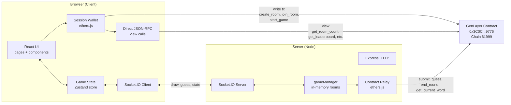
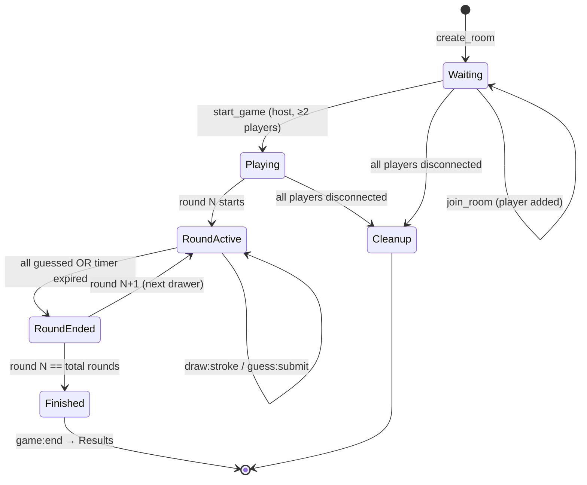
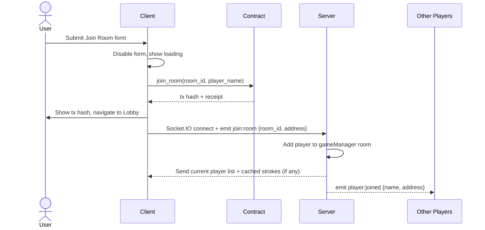
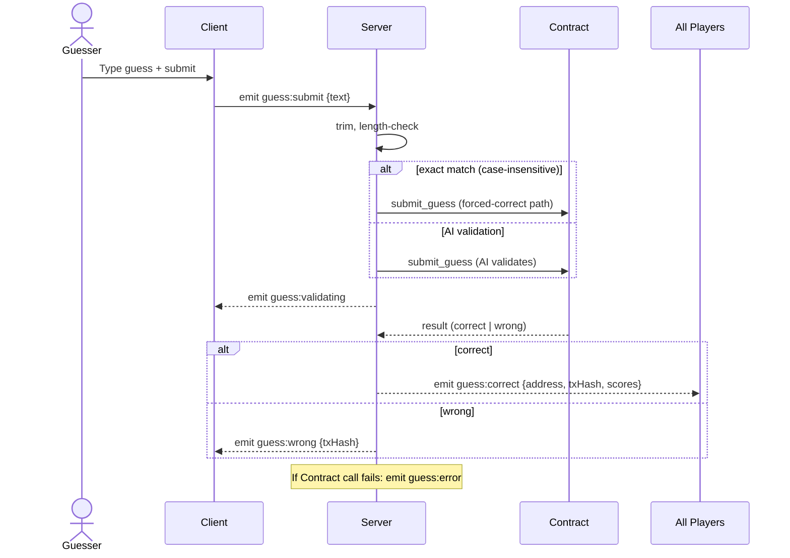

# Design Document

## Overview

GenDraw is a multiplayer drawing-and-guessing game (think Gartic Phone meets on-chain verification) built on the GenLayer blockchain. The system has three cooperating layers:

1. **Client** — A React 18 + Vite SPA styled with TailwindCSS. It owns the UI, the HTML5 Canvas drawing surface, the Session Wallet, and direct view-call access to the Contract.
2. **Server** — A Node.js + Express + Socket.IO backend that fans out real-time game events (strokes, chat, state transitions), holds in-memory per-room state, and orchestrates Contract write calls that must be authoritative for all players (e.g. start_game, submit_guess, end_round).
3. **Contract** — A pre-deployed GenLayer smart contract at `0x3C0C3CdE6eF4D8C11E0cd4E4C2aE04E9981d9776` on GenLayer Testnet (Chain ID `61999`, RPC `https://studio.genlayer.com/api`). It owns the source of truth for room metadata, player roster, the secret Word, AI-validated guesses, and the leaderboard.

### Design Goals

- **Real-time feel, on-chain trust.** Drawing and chat traverse Socket.IO with sub-100ms server fan-out. Anything that decides scores or reveals the Word is settled on-chain so results are independently verifiable.
- **Zero wallet friction.** A Session Wallet generated at first visit and persisted in `localStorage` lets players play immediately without installing MetaMask. Ethers.js signs every Contract call with that key.
- **Greenfield monorepo.** The workspace is empty today, so this design proposes a clean two-package layout (`client/` and `server/`) with a shared `contract/` directory holding ABI, types, and helpers consumed by both runtimes.
- **Responsiveness from 320px to 1920px.** Layout collapses to a single-column drawing+chat view on mobile and expands to a 3-column desktop view at ≥768px.
- **Failure-tolerant.** Socket reconnect with exponential backoff, transaction timeouts, retry on `end_round`, and clear user-facing error messages on every external boundary.

### Key Design Decisions

| Decision | Choice | Rationale |
| --- | --- | --- |
| Word secrecy | Server holds Word, sends only to Drawer over a private Socket event | Contract `get_current_word` is callable from anywhere, but exposing it to all clients would let Guessers cheat. Server is the only trusted relay for the Drawer-only word. |
| Stroke transport | Normalized 0-1 coordinates over Socket.IO, NOT on-chain | Strokes are high-frequency (30+ fps) and not score-relevant. Putting them on-chain would be cost-prohibitive and slow. |
| Score authority | Contract is source of truth, returned via `round:end` and `get_leaderboard` | Prevents server-side tampering; the leaderboard a player sees on Results matches what's queryable on-chain. |
| Transaction polling | Client polls finalization every 2s with 30s timeout | Matches Requirement 12.3 and gives users a reactive "pending → confirmed" experience. |
| Stroke replay for late joiners | Server caches the current round's strokes in memory and replays on `join:room` | Required so a Guesser who joins mid-round sees the in-progress drawing (Req 6.9). |

## Architecture

### High-Level Topology



### Why Some Calls Are Client-Driven And Others Are Server-Driven

| Call | Caller | Reason |
| --- | --- | --- |
| `create_room` | Client | The creator's Session Wallet is the room host; they must sign. |
| `join_room` | Client | Joining player's address must be the `msg.sender`. |
| `start_game` | Client (Host) | Host is the only one allowed to start, and their Session Wallet must sign. |
| `submit_guess` | Server | Centralizes AI-validated calls so guess-rate-limiting and the exact-match shortcut live in one place. The server uses a dedicated server wallet whose address the Contract treats as a privileged relayer (or, if the Contract requires the guesser to sign, the server proxies the user's signed payload — see "Open Contract Question" below). |
| `end_round` | Server | Triggered by timer or "all guessed" condition; needs to fire exactly once per round and retry on failure (Req 9.7). |
| `get_current_word` | Server | Word must reach only the Drawer; centralizing on the server prevents leaking to other clients. |
| `get_leaderboard`, `get_room_count`, `get_total_games` | Client | View-only, public; cheap to call directly. |

> **Open Contract Question:** Whether `submit_guess` requires the guesser's signature or accepts a relayer signature is a Contract-level detail not specified in the requirements. The design assumes a relayer pattern (server signs on behalf of the validated guesser, with the guesser's address passed as a parameter). If the deployed Contract instead requires the guesser to sign, the Client will sign the payload locally and pass the signed transaction to the Server for submission. The Contract Integration Layer abstracts this so only one module changes.

### Repository Layout

```
garticgen/
├── client/                      # Vite + React 18 + TailwindCSS
│   ├── index.html
│   ├── vite.config.ts
│   ├── tailwind.config.js
│   ├── src/
│   │   ├── main.tsx
│   │   ├── App.tsx              # Router
│   │   ├── pages/
│   │   │   ├── Home.tsx
│   │   │   ├── CreateRoom.tsx
│   │   │   ├── JoinRoom.tsx
│   │   │   ├── Lobby.tsx
│   │   │   ├── Game.tsx
│   │   │   └── Results.tsx
│   │   ├── components/
│   │   │   ├── Canvas/
│   │   │   │   ├── DrawingCanvas.tsx
│   │   │   │   ├── ReadOnlyCanvas.tsx
│   │   │   │   ├── Toolbar.tsx
│   │   │   │   └── strokeRenderer.ts
│   │   │   ├── Chat/
│   │   │   ├── PlayerList.tsx
│   │   │   ├── PlayerAvatar.tsx
│   │   │   ├── WordHint.tsx
│   │   │   ├── ScoreCounter.tsx
│   │   │   ├── Podium.tsx
│   │   │   ├── ConnectionStatus.tsx
│   │   │   └── TxHashLink.tsx
│   │   ├── store/
│   │   │   ├── gameStore.ts     # Zustand
│   │   │   └── walletStore.ts
│   │   ├── lib/
│   │   │   ├── sessionWallet.ts # localStorage-backed wallet
│   │   │   ├── contract.ts      # write + view client wrapper
│   │   │   ├── socket.ts        # socket.io client + reconnect
│   │   │   ├── strokes.ts       # normalize/denormalize helpers
│   │   │   ├── wordHint.ts      # buildHint()
│   │   │   └── colors.ts        # avatar color assignment
│   │   └── styles/
│   │       └── theme.css
│   └── package.json
│
├── server/                      # Express + Socket.IO
│   ├── src/
│   │   ├── index.ts             # server bootstrap
│   │   ├── socket/
│   │   │   ├── handlers.ts      # event router
│   │   │   ├── join.ts
│   │   │   ├── draw.ts
│   │   │   ├── guess.ts
│   │   │   └── round.ts
│   │   ├── game/
│   │   │   ├── gameManager.ts   # rooms map + lifecycle
│   │   │   ├── room.ts          # Room state machine
│   │   │   └── timer.ts         # round timer
│   │   ├── contract/
│   │   │   ├── relay.ts         # ethers signer + write helpers
│   │   │   └── views.ts         # JSON-RPC view helpers
│   │   └── lib/
│   │       └── exactMatch.ts    # case-insensitive compare
│   └── package.json
│
├── contract/                    # Shared between client + server
│   ├── abi.json
│   ├── address.ts
│   ├── types.ts                 # TS types for room, player, etc.
│   └── config.ts                # RPC URL, chain ID
│
└── package.json                 # workspace root
```

### Game Lifecycle



### Sequence: Joining a Room



### Sequence: Submitting a Guess



## Components and Interfaces

### Client Components

#### Pages

- **Home (`pages/Home.tsx`)** — Animated logo, tagline, stats panel (calls `get_room_count` + `get_total_games`), Create/Join buttons. Stats hidden on view-call failure (Req 13.5).
- **CreateRoom (`pages/CreateRoom.tsx`)** — Form: player name (1-20), room name (1-30), max players (2-8), rounds (1-5). Validates inline, disables submit until valid (Req 2.7), then calls `create_room` then `join_room` and navigates to Lobby.
- **JoinRoom (`pages/JoinRoom.tsx`)** — Form: room code, player name. Calls `join_room`, surfaces room-status / room-full / not-found errors (Req 3.5, 3.6, 3.9).
- **Lobby (`pages/Lobby.tsx`)** — Copyable room code pill, player list, "Start Game" (host, gated on ≥2 players) or waiting message. Reacts to `player:joined` / `player:left` / `game:state`.
- **Game (`pages/Game.tsx`)** — 3-column layout (≥768px): PlayerList | Canvas+Toolbar+WordHint | Chat. Single-column on <768px hiding PlayerList. Routes Drawer to `DrawingCanvas`, Guesser to `ReadOnlyCanvas`.
- **Results (`pages/Results.tsx`)** — Podium for top 3 (or fewer if room is smaller), confetti, count-up score animation, "Verified by GenLayer" badge, "Play Again" → Home.

#### Canvas Components

```ts
// Drawing-mode canvas (Drawer only)
type DrawingCanvasProps = {
  onStroke: (stroke: Stroke) => void;       // emits draw:stroke
  onClear: () => void;                       // emits draw:clear
  toolbarState: ToolbarState;
};

// Read-only canvas (Guessers)
type ReadOnlyCanvasProps = {
  strokes$: Observable<Stroke>;             // incoming draw:stroke events
  clear$: Observable<void>;                 // incoming draw:clear events
  initialStrokes: Stroke[];                 // replayed when joining mid-round
};

type Stroke = {
  points: Array<{ x: number; y: number }>;  // each in [0,1]
  color: string;                             // hex like "#7c3aed"
  width: number;                             // 2..20 px
  isEraser: boolean;                         // eraser draws background color
};

type ToolbarState = {
  color: string;
  width: number;
  isEraser: boolean;
};
```

The canvas uses `requestAnimationFrame` to batch pointer events into Stroke segments; segments are flushed on `pointerup` and on every animation frame to keep ≥30 fps (Req 6.2). Coordinates are normalized to `[0,1]` against the live canvas size before being emitted, and denormalized against the local canvas size when rendering received strokes (Req 6.3, 6.6).

#### Other UI Components

- **PlayerAvatar** — Circle showing first letter of name, color = `colors.avatarFor(playerIndex)` so colors are deterministic per Room (Req 14.3).
- **WordHint** — Renders the masked word: each letter → underscore, space → wider gap, hyphen → hyphen, with explicit gaps between underscores (Req 7.2, 7.3).
- **ScoreCounter** — When score prop changes, animates from old to new value over 300-1000ms (Req 14.4).
- **TxHashLink** — Renders truncated hash linking to GenLayer explorer.
- **ConnectionStatus** — Banner showing `connected | reconnecting | disconnected`, plus manual reconnect button when retries exhausted (Req 16.4, 16.5).

#### Client State (Zustand)

```ts
type GameStore = {
  // identity
  walletAddress: string;
  playerName: string;

  // room
  roomId: string | null;
  roomStatus: 'waiting' | 'playing' | 'finished';
  players: Player[];
  isHost: boolean;
  drawerAddress: string | null;
  roundNumber: number;
  totalRounds: number;

  // round
  word: string | null;          // populated only for the Drawer
  wordHint: string | null;      // mask shown to Guessers
  strokes: Stroke[];            // for guessers; replayed on rejoin
  scores: Record<string, number>;

  // network
  connection: 'connected' | 'reconnecting' | 'disconnected';
  lastTxHash: string | null;
  pendingTx: { kind: string; startedAt: number } | null;

  // actions
  setWord: (word: string) => void;
  applyStroke: (stroke: Stroke) => void;
  applyClear: () => void;
  applyGuessCorrect: (payload: GuessCorrectPayload) => void;
  // ...
};
```

A separate `walletStore` holds the Session Wallet (constructed once at app boot from the localStorage-backed `sessionWallet.load()`).

### Server Components

#### Socket Event Handler Map

```ts
// Inbound (client → server)
'join:room'      : (payload: { roomId: string; address: string; name: string }) => void
'draw:stroke'    : (payload: Stroke) => void
'draw:clear'     : () => void
'guess:submit'   : (payload: { text: string }) => void

// Outbound (server → clients)
'player:joined'  : { address, name }                               // broadcast to room
'player:left'    : { address, name }                               // broadcast to room
'game:state'     : RoomState                                       // broadcast to room
'word:assign'    : { word: string }                                // unicast to drawer only
'draw:stroke'    : Stroke                                          // broadcast to room (excl. sender)
'draw:clear'     : void                                            // broadcast to room (excl. sender)
'strokes:replay' : Stroke[]                                        // unicast to joiner mid-round
'guess:validating': { text: string }                               // unicast to submitter
'guess:correct'  : { address, name, text, txHash, scores }         // broadcast to room
'guess:wrong'    : { text: string; txHash: string }                // unicast to submitter
'guess:error'    : { reason: string }                              // unicast to submitter
'round:end'      : { word: string; scores: Record<string,number>; nextDrawer: string | null }
'game:end'       : { scores: Record<string,number>; txHash: string | null }
'error'          : { code: string; message: string }
```

#### gameManager

```ts
type RoomState = {
  roomId: string;
  status: 'waiting' | 'playing' | 'finished';
  hostAddress: string;
  players: Map<string, Player>;             // keyed by address
  drawerOrder: string[];                    // addresses in turn order
  currentDrawerIndex: number;
  roundNumber: number;
  totalRounds: number;
  currentWord: string | null;               // server-side only
  strokes: Stroke[];                        // current round's strokes (cleared on round:end)
  scores: Record<string, number>;
  guessedThisRound: Set<string>;            // addresses
  roundTimer: NodeJS.Timeout | null;
  roundDeadline: number | null;             // epoch ms
};

class GameManager {
  rooms: Map<string, RoomState>;
  getOrLoad(roomId): Promise<RoomState>;    // hydrates from Contract on first reference
  addPlayer(roomId, player): void;
  removePlayer(roomId, address): void;
  appendStroke(roomId, stroke): void;
  clearStrokes(roomId): void;
  recordGuess(roomId, address): boolean;     // returns true if all guessers have now guessed
  advanceRound(roomId): { isLast: boolean }; // bumps drawer + round
  destroy(roomId): void;                     // when last player leaves
}
```

#### Contract Relay

```ts
// server/src/contract/relay.ts
export async function submitGuess(roomId: string, guesser: string, guess: string)
  : Promise<{ correct: boolean; txHash: string }>;

export async function endRound(roomId: string)
  : Promise<{ scores: Record<string, number>; txHash: string }>;

export async function getCurrentWord(roomId: string): Promise<string>;
```

Each function uses ethers.js with a server-side signer. `endRound` retries once on failure (Req 9.7); other writes propagate the error so the caller can emit `guess:error` or `error`.

### Contract Integration Layer

Both runtimes share `contract/abi.json` and `contract/types.ts`. The Client uses `ethers.Contract` for writes (with the Session Wallet as signer) and a thin `eth_call` JSON-RPC helper for views (Req 12.4). Each write returns a `Promise<{ txHash, receipt }>` and is paired with `pollFinalization(txHash, intervalMs=2000, timeoutMs=30000)` (Req 12.3, 12.5).

```ts
// contract/config.ts
export const CHAIN_ID = 61999;
export const RPC_URL = 'https://studio.genlayer.com/api';
export const CONTRACT_ADDRESS = '0x3C0C3CdE6eF4D8C11E0cd4E4C2aE04E9981d9776';
```

## Data Models

### Persistent / On-Chain (Contract)

Conceptual shape derived from the contract function signatures (the actual ABI determines exact field names):

```
Room {
  room_id: uint
  name: string
  host: address
  max_players: uint8
  total_rounds: uint8
  status: enum { waiting, playing, finished }
  current_round: uint8
  current_drawer: address
  players: address[]
  player_names: mapping(address => string)
  scores: mapping(address => uint)
  current_word: string  // visible to anyone via get_current_word
}

Leaderboard entry { address, name, score }
```

### In-Memory (Server)

Defined under "gameManager" above. Notable fields:

- `strokes: Stroke[]` — only the current round's strokes; cleared on `round:end`.
- `guessedThisRound: Set<string>` — used to detect "all guessers have guessed" (Req 9.1).
- `roundTimer` — `setTimeout` reference; cleared when round ends early.

### Client Store

Defined under "Client State" above. Key invariants:

- `word` is non-null only when `walletAddress === drawerAddress`.
- `wordHint` is non-null only when the player is a Guesser during an active round.
- `strokes` mirrors what's been received over the socket; cleared on `draw:clear` and on `round:end`.

### localStorage

```
gendraw.session_wallet.private_key : string (0x-prefixed hex)
gendraw.player_name (optional)     : string (last used display name)
```

The Session Wallet loader validates the stored key by attempting to construct `new ethers.Wallet(pk)` and reading `.address`; on any throw the entry is discarded and a new wallet is generated (Req 1.4). When `localStorage` is unavailable (e.g. private mode quotas), an in-memory wallet is created and a warning banner is shown (Req 1.5).

### Wire Formats

```ts
// Stroke on the wire (compact)
type WireStroke = {
  pts: Array<[number, number]>;   // each pair in [0,1]
  c: string;                       // hex color
  w: number;                       // px width 2..20
  e: 0 | 1;                        // eraser flag
};

// Guess submission
type WireGuess = { text: string }; // server trims to 50 chars after receipt
```


## Correctness Properties

*A property is a characteristic or behavior that should hold true across all valid executions of a system — essentially, a formal statement about what the system should do. Properties serve as the bridge between human-readable specifications and machine-verifiable correctness guarantees.*

PBT applies to GenDraw because most game logic is pure: stroke coordinate normalization, hint masking, validation predicates, reducers over game state, exponential-backoff scheduling, podium ordering, and finalization polling are all pure functions or deterministic state machines that can be exhaustively explored with random inputs. Network and Contract calls are mocked so that property tests stay cost-effective. UI rendering, animation timing details, IaC, and visual styling fall back to example or smoke tests.

### Property 1: Session Wallet generation produces a valid persisted wallet

*For any* initially-empty `localStorage`, calling `sessionWallet.init()` returns a wallet whose address is non-empty and matches the address derived from the private key now stored in `localStorage`.

**Validates: Requirements 1.1**

### Property 2: Session Wallet round-trip persistence

*For any* freshly generated Session Wallet `w`, persisting `w` to `localStorage` and then calling `sessionWallet.init()` yields a wallet whose address equals `w.address`.

**Validates: Requirements 1.2**

### Property 3: Session Wallet recovers from invalid stored keys

*For any* string placed in `localStorage` under the session-wallet key that does not parse as a valid Ethereum private key, calling `sessionWallet.init()` returns a working wallet (its address is derivable) and replaces the stored value with a valid private key string.

**Validates: Requirements 1.4**

### Property 4: Form validation matches name length bounds

*For any* `(playerName, roomName, maxPlayers, rounds)` tuple, the Create Room form's submit button is enabled if and only if `1 ≤ len(playerName) ≤ 20` and `1 ≤ len(roomName) ≤ 30` and `2 ≤ maxPlayers ≤ 8` and `1 ≤ rounds ≤ 5`. The same equivalence holds for Join Room with respect to `playerName` length.

**Validates: Requirements 2.7, 3.1**

### Property 5: Room capacity gate

*For any* room with `max_players` in `[2..8]` and any current player count `n ≤ max_players`, the join handler accepts the join if and only if `n < max_players`.

**Validates: Requirements 3.6**

### Property 6: Player roster reducer

*For any* lobby state `S` and any player `p`:
- Applying `player:joined(p)` where `p ∉ S.players` produces a state whose player list equals `S.players ∪ {p}` with no duplicates.
- Applying `player:left(p)` where `p ∈ S.players` produces a state whose player list equals `S.players \ {p}`.
- Applying `player:joined(p)` followed by `player:left(p)` returns the original `S.players` set.

**Validates: Requirements 3.3, 4.3, 4.4, 11.4**

### Property 7: Start-game gate is determined by host status and player count

*For any* `(isHost, playerCount)` tuple where `playerCount` is in `[1..8]`, the Lobby's Start Game button is visible if and only if `isHost`, and is enabled if and only if `isHost ∧ playerCount ≥ 2`. When the button is disabled, pressing it does not invoke `Contract.start_game`.

**Validates: Requirements 4.5, 4.6, 5.1**

### Property 8: Word secrecy

*For any* room of size `N` in `[2..8]` and any round transition (initial start or `end_round` to a non-final round), the `word:assign` socket event is delivered exactly once to the current drawer's socket and zero times to every other connected socket in the room.

**Validates: Requirements 5.2, 9.2**

### Property 9: Game-state broadcast covers every connected player

*For any* room and any inbound game event in `{draw:stroke, draw:clear, guess:submit, guess:correct, round:end, game:end, player:joined, player:left}`, every currently connected socket in that room receives the corresponding outbound event (or the resulting `game:state` snapshot for state-changing events) exactly once.

**Validates: Requirements 5.3, 5.6, 11.3, 11.5**

### Property 10: Stroke coordinate round-trip

*For any* canvas size `(W, H)` with `W, H ≥ 1`, any pointer point `(x, y)` with `0 ≤ x ≤ W ∧ 0 ≤ y ≤ H`, and any second canvas size `(W', H')`, the round trip `denormalize_{W',H'}(normalize_{W,H}((x, y)))` produces a point `(x', y')` with `0 ≤ x' ≤ W' ∧ 0 ≤ y' ≤ H'`. Furthermore, the normalized intermediate `(nx, ny)` satisfies `0 ≤ nx ≤ 1 ∧ 0 ≤ ny ≤ 1`, the emitted `draw:stroke` payload's color equals the toolbar color, and width equals the toolbar width.

**Validates: Requirements 6.3, 6.6**

### Property 11: Mid-round stroke replay reproduces the drawing

*For any* sequence of strokes `S` recorded in a room's current round and any new player joining the room while the round is active, the joiner receives a `strokes:replay` event whose payload equals `S` in order, and rendering `S` on the joiner's read-only canvas produces the same painted-pixel set (modulo per-canvas-size denormalization rounding) as the drawer's canvas after the same `S`.

**Validates: Requirements 6.9**

### Property 12: Word hint masking preserves length and character classes

*For any* word `w`, `buildHint(w)` produces a string with the same overall length, where every alphanumeric character of `w` is replaced by an underscore, every space remains a space (rendered with a wider gap), every hyphen remains a hyphen, and `buildHint(w) ≠ w` whenever `w` contains at least one alphanumeric character. The function is idempotent in the sense that re-applying the same masking rules to `buildHint(w)` is a no-op.

**Validates: Requirements 7.2, 7.3**

### Property 13: Guess input sanitization

*For any* input string `s`, the client either emits no `guess:submit` event when `s.trim()` is empty, or emits exactly one event whose `text` field equals `s.trim().slice(0, 50)` and whose length is at most 50 characters.

**Validates: Requirements 8.1, 8.2**

### Property 14: Guess pipeline routing

*For any* `(word, guess)` pair received by the server during an active round, the server (a) computes `exactMatch(word, guess) = (word.trim().toLowerCase() === guess.trim().toLowerCase())`, (b) calls `Contract.submit_guess(roomId, guess)` exactly once regardless of whether `exactMatch` is true or false, and (c) emits exactly one `guess:validating` event to the submitting socket and zero such events to other sockets.

**Validates: Requirements 8.3, 8.4, 8.5, 8.6**

### Property 15: Guess result fan-out

*For any* room of size `N` and any Contract response to `submit_guess`:
- If the response is "correct", every connected socket in the room receives exactly one `guess:correct` event with the submitter's address, name, the guess text, the transaction hash, and the current scores.
- If the response is "wrong", exactly one `guess:wrong` event is delivered to the submitting socket and zero such events to every other socket in the room.

**Validates: Requirements 8.7, 8.8**

### Property 16: Drawer-only chat input gating

*For any* game state, the chat input is disabled if and only if the local player's address equals the current drawer's address.

**Validates: Requirements 8.12**

### Property 17: Round and game lifecycle

*For any* room with `totalRounds = R` in `[1..5]` and any sequence of guess events:
- `Contract.end_round(roomId)` is invoked exactly once per round, triggered either when every non-drawer player has been recorded as having guessed correctly or when the round timer expires.
- After `end_round` succeeds for round `r < R`, a `round:end` event is broadcast to every connected socket containing the revealed word and the current scores.
- After `end_round` succeeds for round `r = R`, a `game:end` event is broadcast to every connected socket containing the final scores.

**Validates: Requirements 9.1, 9.3, 9.5**

### Property 18: Leaderboard ordering and podium

*For any* leaderboard list `L` returned from the Contract:
- The Results page renders entries in non-increasing order of `score`, with a deterministic tiebreaker (e.g. address ascending).
- The podium displays exactly `min(3, |L|)` slots, and slot `i` (1-indexed) shows the `i`-th entry of the sorted leaderboard.

**Validates: Requirements 10.1, 10.2, 10.3**

### Property 19: Score count-up animation

*For any* score transition from `oldScore` to `newScore` with `oldScore ≤ newScore`, the displayed value at the end of the animation equals `newScore`, the displayed value at every intermediate sampled time is in `[oldScore, newScore]` and is non-decreasing, and the animation duration is in `[300, 1000]` milliseconds.

**Validates: Requirements 10.6, 14.4**

### Property 20: Avatar color is a deterministic function of index

*For any* `(name, index)` with `0 ≤ index < maxPlayers`, the avatar color produced by `colors.avatarFor(index)` is a deterministic function of `index` (independent of `name` and stable across calls), maps into the documented theme palette, and the displayed letter equals `name.charAt(0).toUpperCase()` for non-empty names.

**Validates: Requirements 14.3**

### Property 21: Transaction finalization polling

*For any* simulated transaction with finalization time `t` ms and any timeout `T = 30000` ms with poll interval `I = 2000` ms:
- If `t ≤ T`, `pollFinalization` resolves with success at the first poll boundary `≥ t` (i.e. at time `ceil(t / I) * I`), and the total elapsed time is in `[t, t + I]`.
- If `t > T`, `pollFinalization` rejects with a timeout error at exactly `T` ms.

**Validates: Requirements 12.3, 12.5**

### Property 22: Reconnect backoff schedule

*For any* attempt index `i` in `[0..4]`, the scheduled delay before the `i`-th reconnect attempt equals `1000 * 2^i` milliseconds. The maximum number of automatic attempts is exactly 5; the cumulative status sequence observed by the UI is `disconnected → (reconnecting → disconnected)*` with at most 5 transitions and ends in either `connected` or a final `disconnected` that displays the manual-reconnect button.

**Validates: Requirements 16.4, 16.5**

### Property 23: Local game state preserved across disconnects

*For any* client `gameStore` snapshot `S` taken immediately before the socket disconnects, if no inbound events arrive while disconnected, the store snapshot taken immediately after reconnection equals `S`.

**Validates: Requirements 16.6**

### Property 24: Empty-room cleanup

*For any* room with `N` players, after every player's socket disconnects, `gameManager` no longer contains an entry for that `roomId`.

**Validates: Requirements 11.7**

### Property 25: Responsive layout invariants

*For any* viewport width `w` in `[320..1920]` pixels rendering the Game page:
- `document.scrollWidth ≤ w` (no horizontal overflow).
- If `w < 768`, the player-list sidebar is not rendered, the canvas occupies the available width with at least 280 px, and the chat panel is visible.
- If `w ≥ 768`, the player list, canvas, and chat are all rendered as a 3-column layout.

**Validates: Requirements 15.1, 15.2, 15.3, 15.4**

## Error Handling

### Categorization

The system distinguishes four error families. Each one has a defined recovery path and user-facing surface.

| Family | Examples | Surface | Recovery |
| --- | --- | --- | --- |
| **Validation** | Empty/oversize name, room full, room not found, room status not waiting | Inline form message; specific error banner | User corrects input; no retry button needed |
| **Contract** | Reverted transaction, AI validation failure, consensus timeout | Modal/banner with the Contract's failure reason and the failing operation | Manual retry button on transient errors (timeouts); validation errors require fixed input |
| **Network** | RPC unreachable, view-call HTTP error, Socket.IO connection failure | Dismissible banner naming the operation and reason | Auto-retry for sockets (Property 22); manual retry for RPC/view |
| **Server-internal** | gameManager corruption, missing room state | `error` socket event with `code` + `message`; full client refresh prompt | Reload page (worst case) |

### Specific Handlers

- **Session Wallet failure** (Req 1.5): If `localStorage` access throws, `sessionWallet.init()` constructs an in-memory wallet and `walletStore.persistenceWarning` is set to `true`; the UI renders a dismissible warning banner.
- **Create / Join transaction failure** (Req 2.6, 3.5, 3.6, 3.8, 3.9): The Client surfaces the Contract revert reason verbatim where available; for known reasons (room status, room full, not found) the message is replaced with a friendly equivalent.
- **start_game failure** (Req 5.5): Re-enables the Start Game button and shows the failure reason inline.
- **submit_guess failure** (Req 8.11): Server emits `guess:error` with reason; Client shows an error toast for the submitter without reverting any other state.
- **end_round failure** (Req 9.7): Server retries `Contract.end_round` exactly once. If both attempts fail, it emits an `error` event with `{ code: 'END_ROUND_FAILED', message }` to all sockets in the room; the round timer remains paused so the host (or recovery flow) can intervene.
- **Consensus timeout** (Req 12.3, 12.5, 16.3): `pollFinalization` rejects with a `ConsensusTimeoutError` after 30 s. The Client shows a timeout banner with a "Retry" button that re-invokes the same operation with the same payload.
- **Network error during view call** (Req 12.6, 16.1): Banner shows `Failed to {operation}: {message}`; remains until dismissed.
- **Socket disconnect** (Req 16.4, 16.5, 16.6): The Client schedules reconnects with delays `1000, 2000, 4000, 8000, 16000` ms (up to 5 attempts). `connection` state cycles through `disconnected → reconnecting → connected | disconnected` and is rendered by the `ConnectionStatus` banner. The `gameStore` is not mutated during disconnect; pending UI actions (typing in chat, drawing) are buffered locally and discarded if the player remains disconnected. After 5 failed attempts, a manual reconnect button is shown.
- **Room not yet hydrated on the server** (covered by 11.2): `gameManager.getOrLoad(roomId)` lazily fetches the room from the Contract on first event for that room. On hydration failure the server returns `{ code: 'ROOM_LOAD_FAILED' }` to the requesting socket.

### User-Facing Error Surfaces

- **Inline form errors** for validation problems on Create / Join forms.
- **Toast banner** for transient errors (network, view-call failures).
- **Modal** for game-blocking errors (`END_ROUND_FAILED`, consensus timeout) with explicit retry CTA.
- **Connection status banner** persistent at the top of the screen whenever `connection !== 'connected'`.

## Testing Strategy

### Layered Approach

| Layer | Tooling | What it covers |
| --- | --- | --- |
| Pure-function unit tests | Vitest (client + server) | Hint masking, exact-match comparator, normalize/denormalize, color allocator, polling/backoff math, reducer functions |
| Property-based tests | `fast-check` (Vitest-integrated) | The 25 properties above; every property test runs ≥ 100 iterations |
| Component tests | Vitest + Testing Library | Lobby roster rendering, Toolbar, ScoreCounter, ConnectionStatus, Podium |
| Integration tests | Vitest + mocked Socket.IO + mocked ethers Contract | Full Create→Join→Start→Round→End loops on the server with in-memory rooms |
| E2E smoke tests | Playwright (headless, single run) | Home → Create → Lobby → Game (with a stub Contract) and Results render |
| Contract integration sanity (manual) | GenLayer Studio | One-time check that the deployed Contract address responds to view calls and accepts test transactions |

### Property-Based Testing Configuration

- **Library**: `fast-check` for both client and server (works under Vitest, supports async generators, integrates with Vitest's snapshot runner).
- **Iteration count**: every property test sets `numRuns: 100` minimum; flaky-prone properties (e.g. coordinate round-trip with floating-point tolerances) bump to `numRuns: 200` and pin the seed in CI for reproducibility.
- **Test tagging**: every property-based test is annotated with a comment in the form:

  `// Feature: gendraw-multiplayer-game, Property {N}: {short property description}`

  so a grep can map test → design property.

- **Generators** live under `client/src/lib/__generators__/` and `server/src/__generators__/` and produce: words (with alpha, space, hyphen mixes), strokes (within canvas bounds), room states (variable size and round counts), guess strings (including whitespace-only and >50 char), pointer point sequences, and viewport widths.

### Mocking Strategy

- **Contract**: A `MockContract` exposes the same interface as the real `ethers.Contract` with deterministic returns and configurable failure modes. Property tests for the guess pipeline, round lifecycle, and finalization polling drive `MockContract` to keep iteration cost negligible.
- **Socket.IO**: Server property tests use the in-process `socket.io-mock` style harness — multiple "sockets" connected to a single room without real I/O.
- **Clock**: Vitest fake timers control `setTimeout` for backoff scheduling, finalization polling, round timers, and modal auto-dismiss.
- **localStorage**: A small in-memory mock implements the `Storage` interface; one variant throws on every access to test Req 1.5.

### Example-Based Test Coverage (non-PBT)

Where the prework classified a criterion as `EXAMPLE` or `EDGE_CASE`, we write 1–3 deterministic Vitest tests:

- Routing: form submit → next page transitions (Create→Lobby, Game→Results).
- Toolbar: 8 colors render, slider clamps to 2–20, eraser toggles state.
- Confetti / animated logo / "Verified by GenLayer" badge: render presence assertions.
- Tagline and stats labels: text-content assertions.
- end_round retry: fail-once-succeed and fail-twice-emit-error scenarios.
- Reconnect exhaustion: 5 simulated failures → manual reconnect button rendered.

### Smoke / Performance Tests

- **30 fps drawing** (Req 6.2): A short benchmark in CI that drives synthetic pointer events for 1 second and asserts at least 30 RAF callbacks fired and stroke commits did not coalesce below 30 fps.
- **RPC + chain ID** (Req 12.1, 12.4): A single startup-time smoke that constructs the ethers provider with the documented RPC and chain ID and successfully calls `eth_chainId`.

### Coverage Targets

- 100% of testable acceptance criteria (everything not classified `INTEGRATION` requiring live AWS-style infra) covered by either a property or an example test.
- Each of the 25 properties has a dedicated test file under `*/test/properties/property-{N}-{slug}.test.ts`.
- CI fails on any property test reporting < 100 successful runs or any seed reproduction failure.
