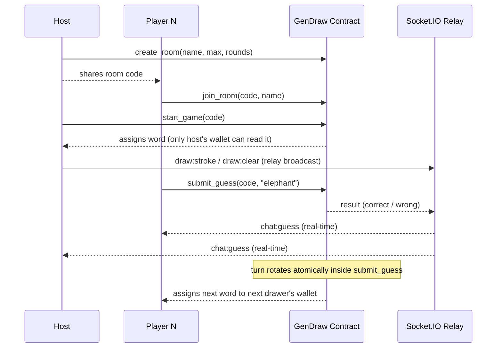

<div align="center">

# GenDraw

**Draw it. Guess it. Win it — on chain.**

A graffiti-style multiplayer drawing-and-guessing game where every guess is a transaction on the [GenLayer](https://genlayer.com) Studionet.
One player draws a secret word that only their wallet can read; everyone else races to guess it. Scoring, rotation,
the weekly leaderboard — all settled by a single deterministic Intelligent Contract.

[](https://gendraw.vercel.app)
[](https://studio.genlayer.com)
[](#tech-stack)
[](#local-development)

[Live demo](https://gendraw.vercel.app) · [Studionet contract](https://studio.genlayer.com) · [Report an issue](https://github.com/nanometa/GenDraw/issues)

</div>

---

## Table of contents

- [What it is](#what-it-is)
- [Why it's interesting](#why-its-interesting)
- [Game flow](#game-flow)
- [Architecture](#architecture)
- [On-chain rules (contract v5)](#on-chain-rules-contract-v5)
- [Repository layout](#repository-layout)
- [Local development](#local-development)
- [Deployment](#deployment)
- [Useful scripts](#useful-scripts)
- [Tech stack](#tech-stack)
- [Roadmap](#roadmap)
- [License](#license)

---

## What it is

GenDraw is a real-time, browser-native drawing party game inspired by classics like Skribbl and Gartic — re-imagined for
the GenLayer chain. Three things make it different from a vanilla web2 clone:

1. **The secret word lives on chain.** It is selected and gated by the contract; only the active drawer's wallet can
   read it. No relay server, no multiplayer hub, no proxy ever sees it.
2. **Every guess is a transaction.** Scoring is the contract's own job. The relay never gets to "decide" if you were
   right — it just routes brushstrokes between players.
3. **Trustless by construction.** Two players in different cities can play the same match without trusting our server
   for anything beyond pixel relay.

## Why it's interesting

- A working demo of how to build a **fast, real-time, multiplayer experience on a slower L1**: the contract owns the
  game state and the secret, while a thin Socket.IO relay handles the parts of the experience the chain shouldn't
  care about (pixels, chat).
- A practical pattern for **client-side spoiler protection** when the relay can't see the secret: the contract is the
  authority, and the UI redacts retroactively when the contract confirms a correct guess.
- A clean monorepo layout (contract / server / client) you can fork and adapt for any "chain owns the rules,
  socket relays the noise" game.

## Game flow



1. **Host creates a room** with `create_room(name, maxPlayers, rounds)`.
2. **Players join** the room (`join_room`). They're tracked both on chain and on a per-room Socket.IO channel so chat
   and strokes stream live.
3. **Host calls `start_game`.** The contract picks a word per turn, visible only to the active drawer's wallet through
   `get_current_word` (which the eth_call gates by `msg.sender`).
4. **The drawer paints.** Strokes broadcast through the relay so guessers see them in real time.
5. **Each guess is its own transaction** (`submit_guess`). The contract awards points, decrements attempts, and rotates
   the drawer atomically when a turn completes.
6. **Final results** read from `get_leaderboard` and route the user to a results screen with podium + tx hashes.

## Architecture

```text
┌──────────────┐                                     ┌──────────────┐
│   Browser    │  draw / chat strokes (Socket.IO)    │              │
│   Player 1   │ ◀──────────────────────────────────▶│  Socket.IO   │
└──────┬───────┘                                     │    relay     │
       │                                             │  (server/)   │
       │ submit_guess / start_game / end_round       │              │
       │                                             │              │
       ▼                                             └──────┬───────┘
┌────────────────────────────────────────┐                  │
│      GenLayer Studionet contract       │                  │
│  - secret word per turn                │  ◀────────────── ┘
│  - scoring + rotation + leaderboard    │  draw / chat (broadcast)
│  - 5 attempts/turn enforcement         │
└────────────────────────────────────────┘                ┌──────────────┐
                  ▲                                       │   Browser    │
                  └───────── submit_guess ────────────────│   Player N   │
                                                          └──────────────┘
```

**Key design decisions**

- **Trust-free relay.** The Socket.IO relay never sees the secret word. It is a stateless fan-out for strokes and a
  best-effort cache for late-joining replay. Every authoritative answer ("you were right", "your turn now", "round over")
  comes from the contract.
- **Polling over pushing.** Each peer polls `get_room` every 2 seconds. This keeps every client in sync with the
  contract even if the relay drops, and means the host doesn't have to push a "game state" event on every transition.
- **Identity-based redaction.** When `guess:correct` comes back, every peer retroactively replaces the local chat
  message that matches `(sender address + sanitized text)` with a phosphor-green system announcement. The literal
  word is exposed for at most ~1–2 s, after which all peers converge on the same redacted log.
- **Per-drawer canvas wipe.** Each peer watches `current_drawer` directly (rather than a `turn` counter that v5
  doesn't always emit, or `current_round` that only bumps once per round). The instant the on-chain drawer changes,
  every client wipes its canvas and the relay's stroke cache.

## On-chain rules (contract v5)

Deployed at **`0xDcF68814DCF7a11B2AbC82Eb08854eBe93174080`** on
[GenLayer Studionet](https://studio.genlayer.com) (chain id `61999`, RPC `https://studio.genlayer.com/api`).

| Rule | Behaviour |
| ---- | --------- |
| **Word pool** | 250 base words + ~190 country names + per-room `add_words` for custom packs |
| **Anti-repeat** | Never re-uses a word within a game; never repeats one of the last 20 used globally |
| **Attempts** | 5 per player per turn |
| **Multi-correct** | Multiple players can guess correctly in one turn — each gets +100; drawer gets +30 once |
| **Turn close** | Auto-closes the moment every non-drawer is correct or out of attempts |
| **Drawer rotation** | Atomic inside `submit_guess`; no separate "advance turn" call required |
| **Weekly leaderboard** | Owner-controlled `current_week` counter rolled forward by `advance_week()` |
| **Player names** | Optional — empty names render as a shortened `0xXXXX…YYYY` |

> v5 replaces v4's timestamp-based week id with a manual counter because GenVM does not expose
> `gl.message.timestamp` (v4 panicked on every correct guess as a result).

## Repository layout

```text
contract/                  GenLayer Studionet config + ABI + shared TS types
  src/abi.json             ABI consumed by both the client (genlayer-js) and server
  src/config.ts            Chain id, RPC URL, deployed contract address
  src/types.ts             Shared Room / Player / Stroke / Leaderboard types

server/                    Socket.IO relay (Node 20 + Express + tsx)
  src/index.ts             HTTP + Socket.IO bootstrap, /healthz probe
  src/socket/              join, draw, guess, round event handlers
  src/game/                in-memory room registry + late-join stroke cache
  src/lib/                 stroke wire codec + exact-match comparator

client/                    React app (Vite + Tailwind + RainbowKit + wagmi)
  src/pages/               Home, CreateRoom, JoinRoom, Lobby, Game, Results, Leaderboard
  src/components/          Canvas (drawing + read-only), Chat, WalletBadge, BrandMark, …
  src/lib/                 contract.ts, socket.ts, strokes, formValidation, guess sanitiser
  src/store/               Zustand store for live game state
  src/styles/theme.css     Brutalist / phosphor design tokens + animations
  public/brand-logo.png    Brand asset used by BrandMark + Home hero

.kiro/                     Spec-driven development artefacts (requirements / design / tasks)
render.yaml                Blueprint for deploying the relay to Render's free tier
vercel.json                Vercel config: framework + SPA rewrites for the client
```

## Local development

**Requirements:** Node.js 20+, npm 10+, and a wallet that supports adding a custom EVM network (MetaMask, Rabby, …).

```bash
git clone https://github.com/nanometa/GenDraw.git
cd GenDraw
npm install
```

Create `client/.env.local` (use `.env.example` as a starter):

```env
VITE_WALLETCONNECT_PROJECT_ID=your_walletconnect_project_id
VITE_SOCKET_URL=http://localhost:3001
```

Then start the client + relay together:

```bash
npm run dev
```

- Client: <http://localhost:5173>
- Relay:  <http://localhost:3001>

When you visit the client, RainbowKit prompts you to connect a wallet and switch to GenLayer Studionet automatically
(chain id `61999`). You'll need a tiny amount of test gas on the network — see the
[GenLayer Studionet docs](https://docs.genlayer.com/) for a faucet.

## Deployment

The client and the relay are split across two hosts because Vercel's serverless functions cannot keep WebSocket
connections open — drawing strokes need a persistent Node process.

### Client → Vercel

1. Import this repo in Vercel and pick `client/` as the **Root Directory**.
2. Build command `npm run build`, output directory `dist` (the included `vercel.json` already wires SPA rewrites).
3. Set the project's environment variables (Settings → Environment Variables):
   - `VITE_WALLETCONNECT_PROJECT_ID`
   - `VITE_SOCKET_URL` — the public URL of the relay (see below)
4. Redeploy.

### Relay → Render (free tier)

The repo ships [`render.yaml`](./render.yaml) as a Blueprint:

1. New + → **Blueprint** in the Render dashboard, then point it at this repo.
2. Render provisions the `gendraw-server` Web Service automatically.
3. Once "Live", copy the public URL (e.g. `https://gendraw-server.onrender.com`) into the Vercel `VITE_SOCKET_URL`
   variable and trigger a fresh client deploy.

> **Heads up:** Render's free tier sleeps a Web Service after ~15 minutes of inactivity. The first request after a
> sleep takes ~30 s to boot. If two players join a room and only one of them sees strokes, the relay is almost
> certainly cold-starting — wait a few seconds and try again, or reach the relay's `/healthz` endpoint to wake it up.

## Useful scripts

```bash
npm run dev            # client (Vite) + relay (tsx watch) together
npm run dev:client     # client only
npm run dev:server     # relay only
npm run build          # type-check + build every workspace
npm run typecheck      # tsc --noEmit across all workspaces
npm run test           # vitest run across all workspaces
npm run test:client    # client test suite only
npm run test:server    # relay test suite only
npm run lint           # ESLint over the whole monorepo
```

## Tech stack

| Layer    | Pieces |
| -------- | ------ |
| Frontend | React 18, Vite, TypeScript (strict), TailwindCSS, Zustand, React Router |
| Wallet   | RainbowKit + wagmi (RainbowKit's `<ConnectButton.Custom>` re-skin), genlayer-js (viem under the hood) |
| Realtime | Socket.IO client / server, custom exponential backoff (`1s → 2s → 4s → 8s → 16s`) |
| Drawing  | HTML canvas, normalized stroke wire format (`Stroke ⇄ WireStroke`) for compact replay |
| Backend  | Node 20, Express, Socket.IO server, tsx in production |
| Chain    | GenLayer Studionet (chain id `61999`) — Intelligent Contract written in Python (GenVM) |
| Tooling  | npm workspaces, ESLint, Vitest, fast-check (property-based tests), Mermaid for diagrams |

## Roadmap

- [ ] On-chain `leave_room` so the existing **Leave Match** UI also removes the player from the active turn rotation.
- [ ] Custom word packs at room creation (UI is already wired to the contract's `add_words`).
- [ ] Spectator mode for users without test gas.
- [ ] Mobile-first canvas tweaks (pressure, palm rejection).
- [ ] Pin the brand colours / phosphor accent into a Tailwind preset for downstream forks.

## License

This repository is shared for the GenLayer hackathon and as a learning reference. Reach out before redistributing.
